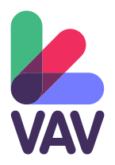

<p align="center">
    
</p>
<h1 align="center">Vue + A-Frame + Vite boilerplate</h1>

> A boilerplate for A-Frame 1.7, Vue 3.5 and Vite 5.4


### [>> DEMO <<](https://onivers.com/aframe-vue-boilerplate/)

## Included in the boilerplate

### Libs and components

- [aframe-extras](https://github.com/c-frame/aframe-extras) (MIT License)
- [aframe physx](https://github.com/c-frame/physx) (MIT License)
- [aframe-blink-controls](https://github.com/jure/aframe-blink-controls) (MIT License)
- [aframe-multi-camera](https://github.com/diarmidmackenzie/aframe-multi-camera/) (MIT License)
- [simple-navmesh-constraint](https://github.com/AdaRoseCannon/aframe-xr-boilerplate) (MIT Licence)

### Movement modes support

- **Desktop** – Keyboard for move (_WASD_ or Arrows keys) + Mouse for look control (Drag and drop)
- **Mobile** – 1x Finger touch to go forward + 2x Fingers touch to go backward + Gaze cursor for click
- **VR/AR** – walk + Teleport (Grip for grab and laser for click) + Gaze cursor for click in AR

### 3D models

- **Main room** – [VR Gallery](https://sketchfab.com/3d-models/vr-gallery-1ac32ed62fdf424498acc146fad31f7e) by [Maxim Mavrichev](https://sketchfab.com/mvrc.art) is licensed under [CC BY 4.0](https://creativecommons.org/licenses/by/4.0/)
- **3D physic room** – [3d_gallery_for_vr_projects](https://sketchfab.com/3d-models/3d-gallery-for-vr-projects-68f77ed8558c4bd59e0a13e2cc9d1fd1) by [tekuto1s](https://sketchfab.com/tekuto1s) is licensed under [CC BY 4.0](https://creativecommons.org/licenses/by/4.0/)

---

## Quickstart

### Create a folder for your project and move to it

### Clone (or fork, or download)

```sh
git clone https://github.com/Chabloz/a-frame-vite-vue-boilerplate.git .
```

### Install dependencies

```sh
npm ci
```

### Dev

```sh
npm run dev
```

### Build

```sh
npm run build
```

## Notes for local dev on VR headset

1. Check that your development device and your VR headset are connected on **the same network**.

2. Expose you local development:

```sh
npm run dev-expose
```

3. In your VR headset, browse to the local development adress `[ip]:[port]`.

> [!NOTE]
> The certificate is self-signed, so you will probably have to confirm access to the resource in your browser.

---

## License


### Sources

- Room: https://sketchfab.com/3d-models/low-poly-isometric-bedroom-b9185fc393cd401495c87ce29a00e49d
- Exit: https://sketchfab.com/3d-models/exit-sign-free-background-prop-439d512e33ae4feabf75b47f47a6ec7a
- Dollar: https://sketchfab.com/3d-models/12-one-dollar-3december2019-d663e682f26b4f8b8f89841139de8cfe
- Briefcase empty: https://sketchfab.com/3d-models/briefcase-empty-low-poly-game-ready-a655a45905a4463d8a390def53a9a25e
- corridor: https://sketchfab.com/3d-models/corridor-98466851c31d44ad8eb92ef4bae49ee7
- post-it:https://sketchfab.com/3d-models/paperclip-on-sticky-notes-edcbd47ab8494b3ca2ce624eda26ec27
- book: https://sketchfab.com/3d-models/old-book-cc887c88fe954dc2a4be11fcfb83fec6
- book Stack: https://sketchfab.com/3d-models/book-stack-90944ea5739248f6b707d6c2b0955c3b
- digital: https://sketchfab.com/3d-models/cc0-keypad-door-lock-b722a6496ab344d78e74bf64be6c8eb8
- old digital clock: https://sketchfab.com/3d-models/old-digital-clock-be2ff14f35364534826363b3c47375fc
- axe with blood: https://sketchfab.com/3d-models/axe-with-blood-a0076e18ea894d83af44d8153451bc82
- blood stain :https://www.cgtrader.com/free-3d-models/character/anatomy/blood-stain-2f56a6db-b1b9-41c3-9425-92a4253894c5
- key: https://sketchfab.com/3d-models/key-7a0f6aaffe604d65bb560955990ce68b
- mail icon: https://sketchfab.com/3d-models/mail-icon-b9133b28050d43aeb973aa0f08f86441
- wanted-pic: https://www.canva.com/templates/EAGXKr9IkoI-black-and-beige-vintage-criminal-wanted-poster/
- search-icon:https://sketchfab.com/3d-models/magnifying-glass-icon-2094f75721eb41f1bb8a4a04d258bd6b
- super keyboard : The MIT License (MIT) Copyright (c) 2017 Diego F. Goberna diego@feiss.be


